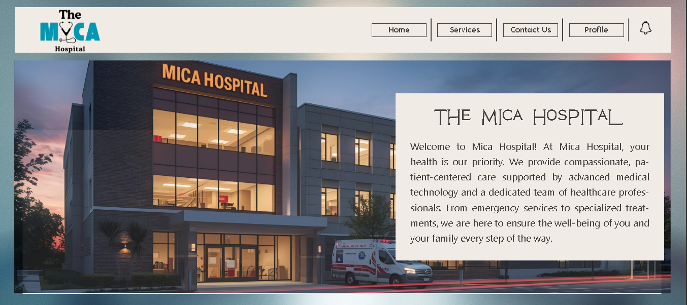
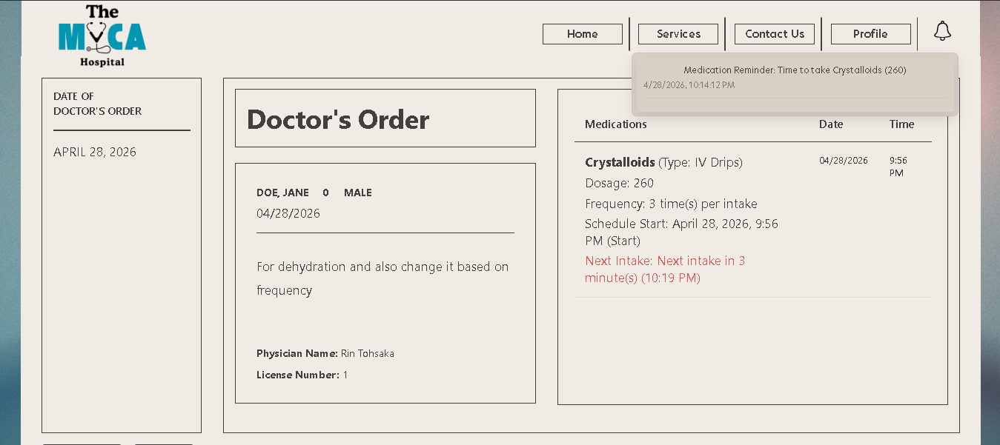
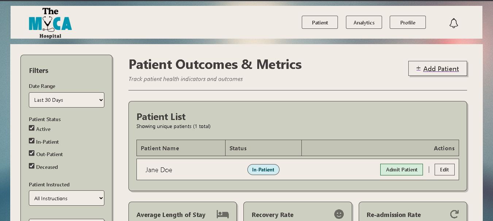

# E-Charting

E-Charting is a web-based patient charting system designed to assist nurses and healthcare staff in documenting patient information, tracking health outcomes, and managing clinical workflows in a structured and efficient manner.

---

## Overview

E-Charting was developed as a passion project to address the challenges of manual and fragmented patient documentation. The system provides a centralized interface for managing patient records, monitoring status, and analyzing healthcare data.

The design emphasizes clarity, accessibility, and ease of use for medical staff, ensuring that critical information is readily available.

---

## System Preview

### Home Interface Sample


### Patient Profile Interface Sample


### Patient Metrics Dashboard Sample


---

## Core Features

- Patient record creation and management
- Patient status tracking (active, in-patient, out-patient, deceased)
- Outcome and metrics monitoring
- Filtering system for patient data
- Dashboard for healthcare insights
- Simple and structured UI for clinical workflows

---

## System Workflow

1. Users access the system through a web interface
2. Patient data is created, updated, and stored in the database
3. Nurses and staff can:
   - View patient lists
   - Update patient status
   - Track outcomes and metrics
4. Data is displayed through dashboards and tables for quick analysis

---

## Tech Stack

- PHP (Backend Logic)
- HTML, CSS, JavaScript (Frontend)
- MySQL (Database)
- XAMPP (Local Development Environment - Apache & MySQL)

---

## System Architecture

The system follows a basic web application structure:

- Frontend: Handles user interface and interactions
- Backend (PHP): Processes requests and manages logic
- Database (MySQL): Stores patient records and system data

[Inference] The architecture appears to follow a traditional client-server model commonly used in PHP-based systems.

---

## Database Overview

The system uses MySQL to manage structured patient data.

Typical data handled includes:

- Patient information
- Status records
- Health metrics
- Activity logs

[Inference] Exact schema is not fully documented in the repository. Consider adding a `.sql` file or ER diagram for clarity.

---

## Installation Guide

### Requirements

- XAMPP (Apache + MySQL)
- Web Browser

### Steps

1. Clone the repository:
```bash
git clone https://github.com/kurtreonal/E-Charting.git
cd E-Charting
```

2. Move the project folder to:
```
C:\xampp\htdocs\
```

## Project Status

This project is currently on hold. Development and feature updates are paused due to other commitments.

While the repository is available for viewing and reference, it may not receive further updates, deployment, or active maintenance at this time.

---

## Limitations

- Not deployed to a production environment
- Limited scalability in current architecture
- No advanced authentication or role-based system implemented yet
- Database schema not fully documented

---

## Future Improvements

- Role-based authentication (admin, nurse, staff)
- Improved UI/UX design
- Advanced analytics and reporting
- Deployment to a live server
- API integration for external systems

---

## Contribution

Contributions, suggestions, and improvements are welcome. Feel free to fork the repository and submit pull requests.

---

## License

This project is intended for academic and personal use.
